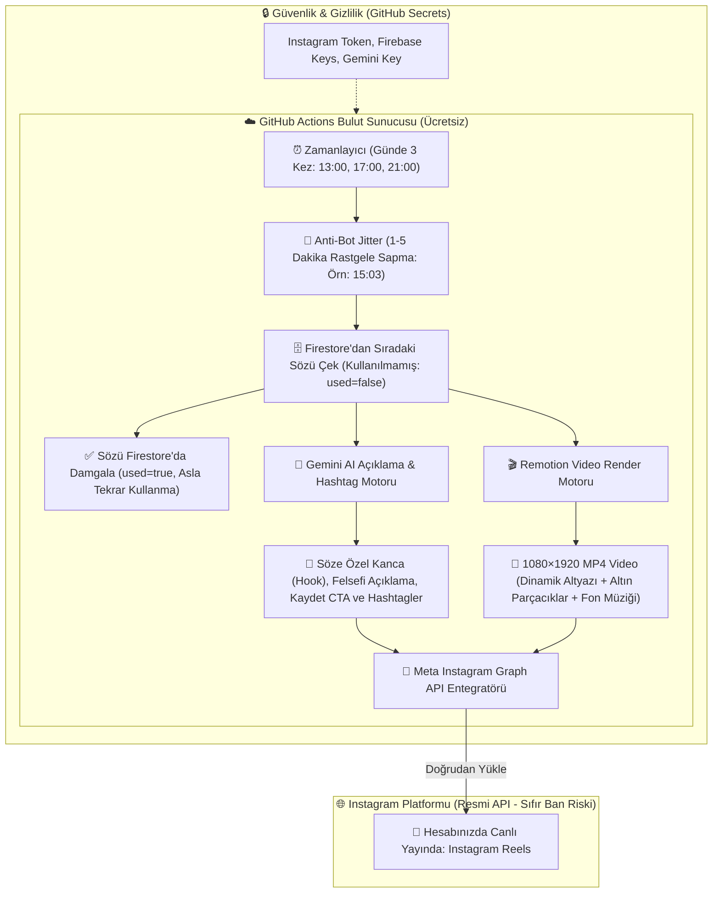

# 🚀 #MEVZU — %100 Bulut Tabanlı Tam Otomatik Instagram Reels Fabrikası

Bu plan, **Erol-Mevzu** projesine **Remotion** video motorunu entegre etmeyi, **Gemini AI** ile söze özel dinamik açıklamalar üretmeyi ve **GitHub Actions + Meta Instagram Graph API** kullanarak telefon ya da bilgisayar açık kalmasına gerek olmadan **%100 otonom (full otomatik)** bir Instagram yayın fabrikası kurmayı hedefler.

---

## 📱 Hedeflenen Video Görsel Tasarımı (Mockup)

Remotion ile kare kare üretilecek 1080×1920 dikey video şablonu:

### 🎨 Görsel & Algoritma Odaklı Detaylar:
1. **Dinamik Altyazı (Karaoke Highlight):** Söz ekranda akarken okunan kelimeler parlak altın sarısı renkle yanarak izleyicinin ilk 2 saniyede kaydırmasını engeller.
2. **Atmosferik Arka Plan:** Derin mat siyah üzerine hafif altın tozu parçacıkları (`gold dust`) ve nabız gibi atan yumuşak ışık aurası.
3. **Loop Stratejisi (Keşfet Tetikleyici):** 7–9 saniyelik optimize video uzunluğu; kullanıcı sözü okurken video arkada 2. tura döner, izlenme oranı %100'ü aşar ve Keşfet algoritmasını ateşler.
4. **Marka & Yazar:** Üstte şık `#MEVZU”` logosu, altta yazar ve kategori rozeti.

---

## 🔄 Tam Otomatik Mimari ve İş Akış Şeması

Aşağıdaki şema, günde 3 kez hiçbir insan müdahalesi olmadan sistemin nasıl çalışacağını gösterir:

---

## 🧠 Algoritma & Anti-Bot Koruma Mekanizmaları

1. **Jitter (Zaman Sapması):**
   * Gönderiler asla tam saniyesinde atılmaz. Her tetiklemede 1 ila 5 dakika arasında rastgele bir gecikme eklenir (`13:03:14`, `17:01:42`, `20:58:19`). Instagram hesabı normal bir insanın kullandığını varsayar.
2. **Söze Özel Dinamik Açıklama (Gemini AI):**
   * Her video için sözün ruhuna uygun 3 bölüm üretilir:
     * *Kanca:* "Çoğu insanın hayatın sonunda fark ettiği o gerçek..."
     * *Alt Metin:* Sözün felsefi anlamı (1-2 cümle).
     * *Etkileşim Çağrısı (CTA):* "Kendine hatırlatmak için kaydetmeyi ve bir dostuna göndermeyi unutma 📌"
     * *Hashtag:* Sözün kategorisine göre 5-7 odaklı etiket.
3. **Tek Kullanımlık Söz Kuralı:**
   * Firestore'dan çekilen sözün `used` alanı anında `true` yapılır. Havuzdaki hiçbir söz asla ikinci kez paylaşılmaz.

---

## 📋 Uygulama Adımları

### 1. Remotion Şablonu ve Dinamik Altyazı
* `remotion`, `@remotion/player`, `@remotion/cli` ve `@remotion/renderer` paketlerinin kurulması.
* `src/remotion/MevzuReelsComposition.jsx` ve `AnimatedSubtitles.jsx` ile altın highlight efektli video şablonunun kodlanması.

### 2. Gemini AI Açıklama & Hashtag Scripti
* `scripts/generateCaption.mjs`: Firestore'dan gelen söze göre yapay zeka ile profesyonel Instagram açıklaması üreten modül.

### 3. Otomasyon & Instagram Graph API Yayınlayıcı
* `scripts/renderAndPublish.mjs`:
  1. Sözü çekip damgala
  2. Gemini ile açıklamayı yazdır
  3. Remotion ile 1080x1920 MP4 üret
  4. Instagram Graph API üzerinden Reels olarak yayınla.

### 4. GitHub Actions Zamanlayıcı (Cron İş Akışı)
* `.github/workflows/reels-publisher.yml`: Günde 3 kez (sabah, ikindi, akşam) uyanıp jitter ile scripti çalıştıran bulut görevi.
