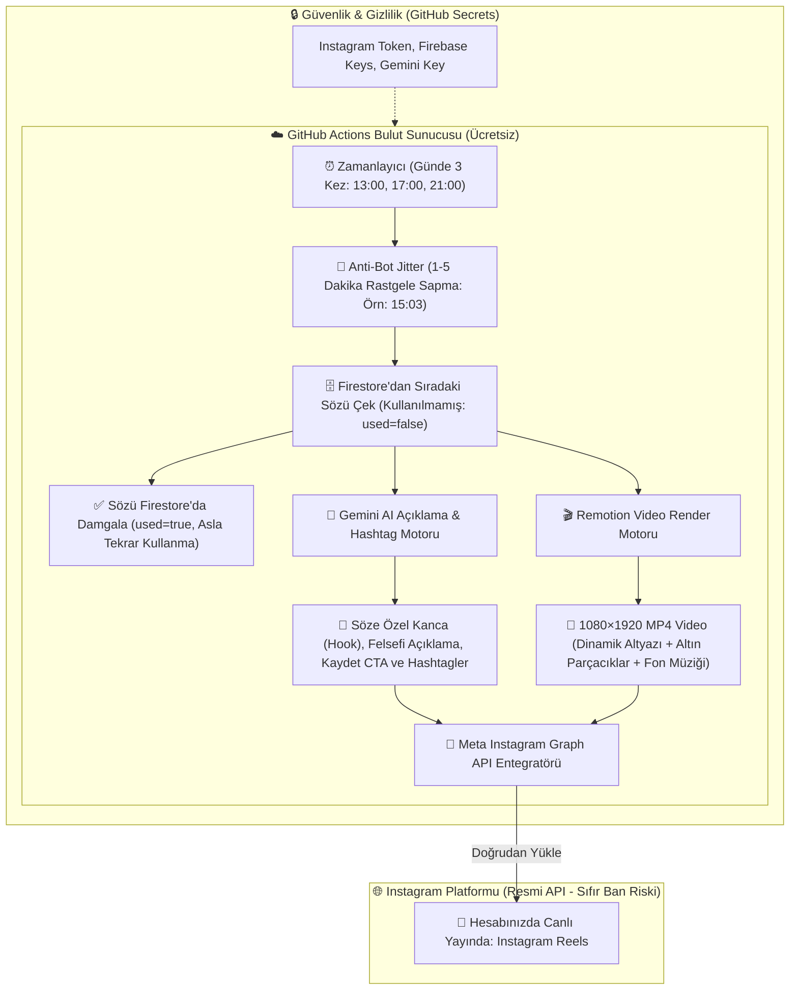

# 🚀 #MEVZU — %100 Bulut Tabanlı Tam Otomatik Instagram Reels Fabrikası

Bu plan, **Erol-Mevzu** projesine **Remotion** video motorunu entegre etmeyi, **Gemini AI** ile söze özel dinamik açıklamalar üretmeyi ve **GitHub Actions + Meta Instagram Graph API** kullanarak telefon ya da bilgisayar açık kalmasına gerek olmadan **%100 otonom (full otomatik)** bir Instagram yayın fabrikası kurmayı hedefler.

---

## 📱 Hedeflenen Video Görsel Tasarımı (Mockup)

Remotion ile kare kare üretilecek 1080×1920 dikey video şablonu:


### 🎨 Görsel & Algoritma Odaklı Detaylar:
1. **Dinamik Altyazı (Karaoke Highlight):** Söz ekranda akarken okunan kelimeler parlak altın sarısı renkle yanarak izleyicinin ilk 2 saniyede kaydırmasını engeller.
2. **Atmosferik Arka Plan:** Derin mat siyah üzerine hafif altın tozu parçacıkları (`gold dust`) ve nabız gibi atan yumuşak ışık aurası.
3. **Loop Stratejisi (Keşfet Tetikleyici):** 7–9 saniyelik optimize video uzunluğu; kullanıcı sözü okurken video arkada 2. tura döner, izlenme oranı %100'ü aşar ve Keşfet algoritmasını ateşler.
4. **Marka & Yazar:** Üstte şık `#MEVZU”` logosu, altta yazar ve kategori rozeti.

---

## 🔄 Tam Otomatik Mimari ve İş Akış Şeması

Aşağıdaki şema, günde 3 kez hiçbir insan müdahalesi olmadan sistemin nasıl çalışacağını gösterir:



---

## 🧠 Algoritma & Anti-Bot Koruma Mekanizmaları

1. **Jitter (Zaman Sapması):**
   * Gönderiler asla tam saniyesinde atılmaz. Her tetiklemede 1 ila 5 dakika arasında rastgele bir gecikme eklenir (`13:03:14`, `17:01:42`, `20:58:19`). Instagram hesabı normal bir insanın kullandığını varsayar.
2. **Söze Özel Dinamik Açıklama (Gemini AI):**
   * Her video için sözün ruhuna uygun 3 bölüm üretilir:
     * *Kanca:* "Çoğu insanın hayatın sonunda fark ettiği o gerçek..."
     * *Alt Metin:* Sözün felsefi anlamı (1-2 cümle).
     * *Etkileşim Çağrısı (CTA):* "Kendine hatırlatmak için kaydetmeyi ve bir dostuna göndermeyi unutma 📌"
     * *Hashtag:* Sözün kategorisine göre 5-7 odaklı etiket.
3. **Tek Kullanımlık Söz Kuralı:**
   * Firestore'dan çekilen sözün `used` alanı anında `true` yapılır. Havuzdaki hiçbir söz asla ikinci kez paylaşılmaz.

---

## 📋 Uygulama Adımları

### 1. Remotion Şablonu ve Dinamik Altyazı
* `remotion`, `@remotion/player`, `@remotion/cli` ve `@remotion/renderer` paketlerinin kurulması.
* `src/remotion/MevzuReelsComposition.jsx` ve `AnimatedSubtitles.jsx` ile altın highlight efektli video şablonunun kodlanması.

### 2. Gemini AI Açıklama & Hashtag Scripti
* `scripts/generateCaption.mjs`: Firestore'dan gelen söze göre yapay zeka ile profesyonel Instagram açıklaması üreten modül.

### 3. Otomasyon & Instagram Graph API Yayınlayıcı
* `scripts/renderAndPublish.mjs`:
  1. Sözü çekip damgala
  2. Gemini ile açıklamayı yazdır
  3. Remotion ile 1080x1920 MP4 üret
  4. Instagram Graph API üzerinden Reels olarak yayınla.

### 4. GitHub Actions Zamanlayıcı (Cron İş Akışı)
* `.github/workflows/reels-publisher.yml`: Günde 3 kez (sabah, ikindi, akşam) uyanıp jitter ile scripti çalıştıran bulut görevi.


  "quoteId": "quote_doc_id",
  "quote": "Bir şeyin doğru olduğunu düşünmek, onu doğru yapmaz.",
  "author": "Immanuel Kant",
  "category": "FELSEFE",
  "musicId": "mixkit_587",
  "musicUrl": "https://assets.mixkit.co/music/587/587.mp3",
  "musicSource": "mixkit",
  "bgId": "statue",
  "fileName": "reel_20260915_2322_ORNJ.mp4",
  "renderedAt": "2026-09-15T20:23:29.093Z",
  "published": false,
  "instagramId": null
}
```
* Instagram'a yayınlandığında `published: true` ve `instagramId` alanları güncellenerek çift paylaşım riski sıfırlanır.
---
## 🎨 65 Adet Sinematik Dikey Arka Plan & Akıllı Çeşitlilik Motoru (`CinematicBackground.jsx`)
Kullanıcılara her videoda görsel zenginlik sunmak ve "hep aynı deniz/orman geliyor" tekdüzeliğini tamamen kırmak için arka plan havuzu 15'ten **65'e** çıkarılmıştır:
### 1. Kategori Dağılımı (1080×1920 Dikey Format)
* **🌊 Doğa & Su (15+ Parça):** Turkuaz okyanuslar, fırtınalı koyu sular, sisli çam ormanları, tropik kumsallar, dağ gölleri, çağlayan nehirler, şelaleler ve yağmur damlaları.
* **🏔️ Element & Doğa (15+ Parça):** Gece kamp ateşleri, volkanik lavlar, altın gün batımı & dağ sıraları, karlı zirveler, çöl kum tepeleri, fırtına & şimşekler.
* **🏛️ Felsefe & Kültür (10+ Parça):** Antik Roma/Yunan mermer heykelleri, tapınaklar, devasa klasik kütüphaneler, tarihi el yazması ve taş kemerler.
* **🌌 Kozmik & Uzay (12+ Parça):** Yıldızlararası galaksiler, derin nebulalar, kuzey ışıkları (aurora), dolunay, süpernovalar ve derin uzay boşluğu.
* **🏙️ Şehir & Siber Gece (10+ Parça):** Yağmurlu neon metropoller, gece otoyol akışları, fütüristik kuleler ve siberpunk sokaklar.
* **🖤 Minimalist (1 Parça):** Mat siyah zemin üzerine saf lüks altın parçacık aurası.
### 2. Akıllı Tekrarsız Seçim Motoru (`lastBgRef`)
* Bir önceki render'da veya tıklamada gelen arka plan görseli hafızada tutulur (`lastBgRef`).
* **"✨ Sihirli Uyumlu Oluştur"** butonuna basıldığında bir önceki görsel otomatik olarak havuzdan elenir; **arka arkaya asla aynı görsel seçilmez**.
### 3. Otomatik Zıt Kontrast & Okunabilirlik Sistemi
* Her görsel için özel `contrastAccent` ve `overlay` renkleri atanmıştır:
  * Örneğin turkuaz/mavi denizde yazı otomatik olarak **Kraliyet Altın Sarısı (`#f5c542`)** parlar.
  * Turuncu gün batımında veya ateşte yazı **Buz Mavisi (`#38bdf8`)** yanar.
  * Siyah/karanlık temalarda **Neon Sarı (`#facc15`)** ile %100 okunurluk garantilenir.
* Arka plandaki Ken Burns kamera hareketi ve partikül efektleri 65 görselin tümünde akıcı olarak çalışır.


